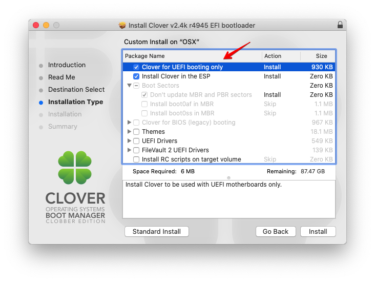

> Some experience for playing with Hackintosh.

I will not explain why to try a hackintosh, basically, because of the beauty of the macOS and the price of a mackintosh. lol...

## Build

In general, the best build for a hackintosh is Intel CPU + AMD graphic card, but what I have on my machine is the opposite, I have a AMD Ryzen 2600x and a Nvidia 1060 ti graphic card 

My current build is:

> CPU: AMD Ryzen 2600x
>
>  Graphic Card: Nvidia GTX 1060 Ti
>
>  Motherboard: MSI B450M Motar

I followed the link of [this](https://www.jianshu.com/p/5203dc0d83ef) artical and the OS can be installed successfully. The OS version is High Sierra (14.3.4)

The first problem I met is the graphic card is not working properly. Download Nvidia webdriver fixed the problem. 

## TODO

The only problem left so far is I cannot use Pulse Secure to connect to the vpn. Every time when it reaches the step of "securing connections" the whole OS will be reboot suddenly. 

Tried below solutions but with no luck so far:

1. Use different version of Pulse Secure. I tried with 9.1, 9.0, 5.2, 5.3 but no one works. 
2. I tred to install a windows VM and use PS in windows and share files between these two OSes, it works fine. However, I am not able to debug the application as it requires connection to other services in office's network. 

3. I also want to try the latest version of High Sierra (14.3.6) but haven't finished yet.

Upgrade to the latest version of macOS of High Sierra solved the problem !!! 

Also if it complains something about net.pulsesecure.PulseSecureFirewall kext, go directly to the /Library/Extensions directory and delete that kext.

Clover configuration modifies the config.plist file
Clover modifies kexts or drivers of your EFI volume

## How to get rid of the USB stick after the installation is finshed?

1. Run Clover and choose first two to make your hard driver be bootable.

2. Copy the `EFI` directory from your USB to your hard driver.
3. Finished